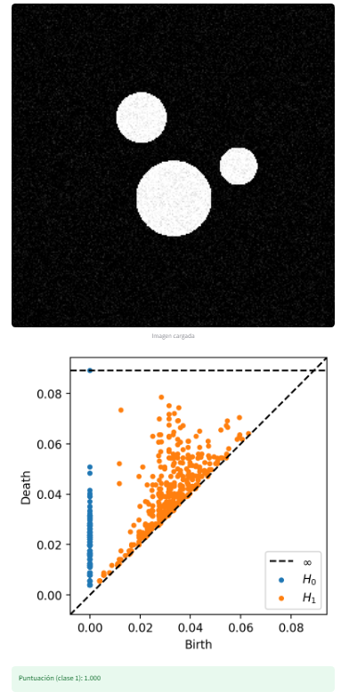

# 🧠 Análisis Topológico de Lesiones Cutáneas (TDA Skin Lesions)


---

## 🧩 Descripción general

Este proyecto demuestra cómo la **Topología Algebraica**, a través de la **Homología Persistente**,  
puede aplicarse al **análisis y clasificación de imágenes biomédicas**, específicamente **lesiones cutáneas**.  

Desarrollado completamente en **Python**, integra herramientas de:
- 🧬 Análisis de imagen (scikit-image)
- 🔢 Topological Data Analysis (Ripser, Persim)
- 🤖 Machine Learning (Scikit-Learn)
- 🌐 Interfaz interactiva (Streamlit)

> 💡 **Autor:** Luis Ángel Damián Gómez  
> Estudiante de Matemática  – Universidad Nacional del Altiplano (UNA Puno, Perú)  
> 📧 *luis.e7.damian@gmail.com*

---

## 🌐 Demostración interactiva



> Ejemplo de análisis topológico de una lesión simulada.  
> Se visualiza el diagrama de persistencia (H₀ y H₁) y la puntuación del modelo.

---

## ⚙️ Instalación y ejecución rápida

```bash
# 1️⃣ Clonar el repositorio
git clone https://github.com/ladg072004/tda-skin-lesions.git
cd tda-skin-lesions

# 2️⃣ Instalar dependencias
pip install -r requirements.txt

# 3️⃣ Entrenar modelo de prueba (20 imágenes sintéticas)
python -m tda_skin.train --data_dir sample_images --out models

# 4️⃣ Ejecutar la aplicación interactiva
streamlit run tda_skin/demo_app.py

💬 “Donde la topología se encuentra con la medicina, la matemática se vuelve una herramienta para salvar vidas.”
